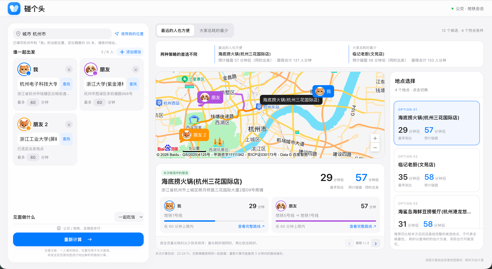

# 碰个头


一个同城多人会合地点推荐工具。填写大家的出发地点和可接受的出行时间，选择喝咖啡或一起吃饭，即可根据公交、地铁路线寻找合适的见面地点。

基于 **Python + FastAPI + 原生 HTML/CSS/JavaScript + 百度地图 JSAPI GL**，无需前端构建工具或数据库。

## 项目展示



## 具体功能

- **多人出发信息**：支持 2～6 位参与者，分别搜索出发地点，设置 5～180 分钟的出行时间上限；支持更换动物头像。
- **自动定位**：获得浏览器定位授权后，自动填写城市和自己的出发地点，也可手动搜索。
- **两类聚会场景**：支持「喝杯咖啡」和「一起吃饭」，检索对应的咖啡厅或餐厅。
- **两种推荐策略**：可切换「最远的人也方便」和「大家总耗时最少」，对比两种策略的首选地点与耗时。
- **地图与路线展示**：展示参与者位置、候选地点和出行路线，查看每人的预计耗时、公交或地铁方案，并跳转百度地图查看完整路线。
- **时间限制与备选建议**：优先推荐所有人都能在各自时间上限内到达的地点；没有符合条件的地点时，给出放宽时间限制的建议。
- **桌面与手机布局**：桌面端并列展示出发信息、地图和候选地点，手机端通过标签切换不同区域。

| 推荐策略 | 排序方式 |
| --- | --- |
| 最远的人也方便 | 优先降低全员中的最长出行耗时，相同时再比较总耗时 |
| 大家总耗时最少 | 优先降低所有人的出行耗时之和，相同时再比较最长耗时 |

当前支持出发点两两相距不超过 80 公里的同城会合，每次最多评估 12 个候选地点。推荐仅比较本次召回且全员路线完整的候选，不代表全城最优；出行耗时以查询时的估计为准。

## 项目结构

```text
penggetou/
├── app/
│   ├── __init__.py
│   ├── main.py             # FastAPI 入口、接口与静态页面服务
│   ├── models.py           # 参与者、地点和推荐请求的数据模型
│   ├── baidu.py            # 百度地图接口、候选召回、路线查询与缓存
│   └── planner.py          # 时间限制判断、推荐排序与放宽建议
├── static/
│   ├── index.html          # 页面结构
│   ├── styles.css          # 页面样式与移动端适配
│   ├── app.js              # 表单交互、定位、地图与结果展示
│   ├── avatars/            # 参与者头像素材
│   ├── favicon.svg         # 网站图标
│   └── meeting-map.svg     # 未查询时的地图插画
├── docs/images/preview.png # README 展示截图
├── .env.example            # 环境变量配置示例
├── .gitignore
├── requirements.txt        # 依赖版本范围
├── requirements.lock       # 固定版本依赖
└── README.md
```

## 如何运行

### 1. 安装依赖

需要 Python 3.11 或更新版本，建议使用 Python 3.13。在项目根目录执行以下命令，使用项目内的虚拟环境：

```bash
python3 -m venv .venv
.venv/bin/python -m pip install -r requirements.lock
```

如果已有 `.venv`，可以跳过创建步骤。以上命令适用于 macOS / Linux。

### 2. 配置百度地图

在百度地图开放平台准备两个 AK：

- **服务端 AK**：用于地点检索、轻量公交路线规划和逆地理编码，需开通对应服务。支持 IP 白名单和 SN 签名校验；选择 SN 时还需配置对应的 `BAIDU_SERVER_SK`。
- **浏览器 AK**：用于 JSAPI GL 地图展示，需配置允许的 Referer，包含本地访问地址。

首次配置时，复制环境变量模板；已有 `.env` 时直接编辑，避免覆盖原配置：

```bash
cp .env.example .env
```

在 `.env` 中填写：

```dotenv
BAIDU_SERVER_AK=你的服务端AK
BAIDU_SERVER_SK=
BAIDU_BROWSER_AK=你的浏览器AK
```

服务端 AK 仅由后端使用，浏览器 AK 用于网页加载地图。缺少服务端 AK 时无法进行真实查询；缺少浏览器 AK 时无法显示地图，但仍可使用后端推荐和完整路线链接。`.env` 已加入忽略列表，请勿提交真实密钥。

### 3. 启动服务

在项目根目录执行：

```bash
.venv/bin/python -m uvicorn app.main:app --host 127.0.0.1 --port 8765
```

浏览器打开 [http://127.0.0.1:8765](http://127.0.0.1:8765)。修改 `.env` 后需要重启服务。

### 4. 开始使用

1. 允许浏览器定位，或手动填写城市并搜索出发地点。
2. 添加同行朋友，为每个人选择出发地点和可接受的出行时间。
3. 选择「喝杯咖啡」或「一起吃饭」，点击计算按钮。
4. 切换推荐策略和候选地点，查看地图、预计碰面时间与每个人的路线。

浏览器定位需要在 localhost、127.0.0.1 或 HTTPS 页面下使用，定位失败时可手动搜索。查询会调用百度地图服务，位置和路线数据可能在内存中缓存 3 分钟；当前应用适合本地单进程运行。

## 部署到魔搭创空间

选择 Docker 框架、免费 CPU 资源，端口设为 `7860`，使用仓库中的 `Dockerfile`。在平台密文变量中配置 `BAIDU_SERVER_AK`、`BAIDU_BROWSER_AK`；若百度控制台选择 SN 校验，同时配置 `BAIDU_SERVER_SK`。SK 必须与服务端 AK 对应，仅参与服务端签名，不会传给浏览器。

将实际应用域名加入浏览器 AK 的 Referer 白名单。SN 校验不依赖服务器出口 IP；切换后，本地 `.env` 也需补充 SK 才能继续调用。未配置 SK 时继续使用原来的 IP 白名单方式。密钥变量变更后需重新部署；保持单进程，确保请求限流队列有效。

## 部署到 Render 免费版

仓库内的 `render.yaml` 配置了免费的 Python Web Service，使用新加坡区域、Python 3.13、固定版本依赖及单进程启动。密钥在 Render 环境变量中填写，不提交到仓库。

1. 在 Render 创建 Blueprint，连接本仓库的 `main` 分支。
2. 确认实例类型为 **Free**，填写 `BAIDU_SERVER_AK` 和 `BAIDU_BROWSER_AK`。
3. 部署完成后，将实际分配的域名加入百度浏览器 AK 的 Referer 白名单；服务端 AK 如果使用 IP 白名单，则核对 Render 的出口地址。
4. 使用公网 HTTPS 地址检查页面、地点搜索和路线推荐。

免费实例闲置 15 分钟会休眠，再次访问通常需要约一分钟唤醒。网站托管额度与百度地图接口配额分别计算；当前为单进程演示应用，请保留请求限速。访问日志已关闭，避免记录地点搜索词。

参考：[Render 免费版限制](https://render.com/docs/free)、[Python 版本设置](https://render.com/docs/python-version)。
